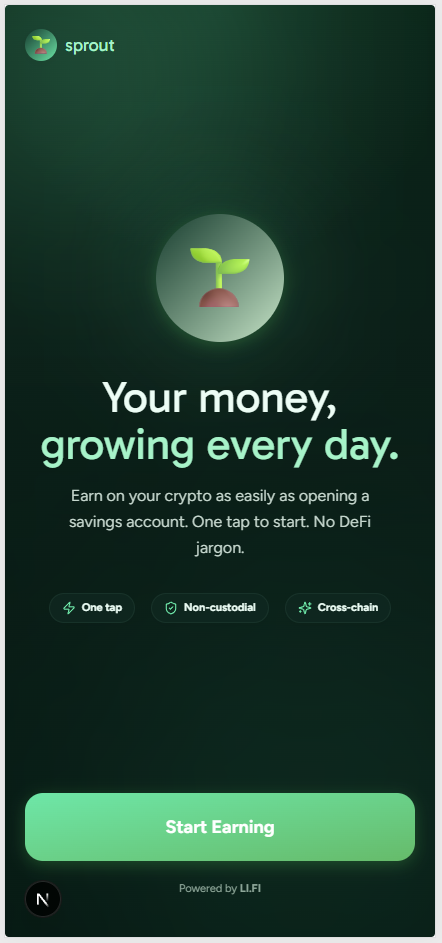
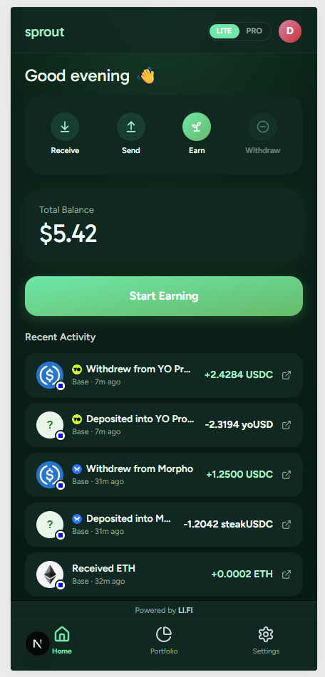
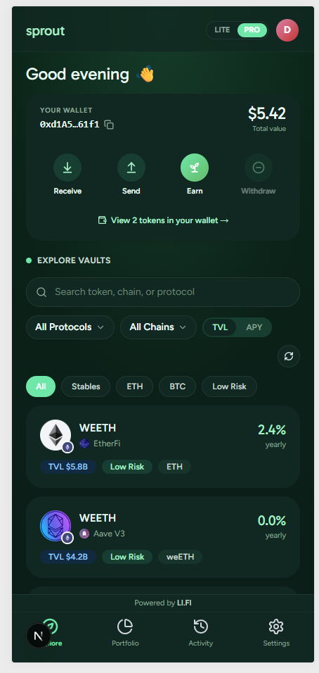
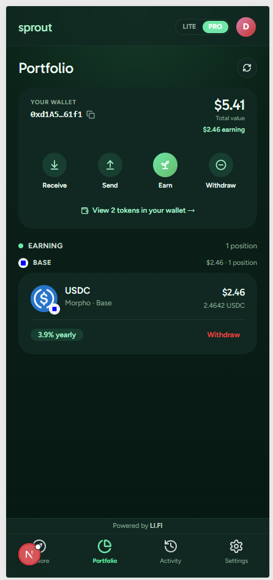
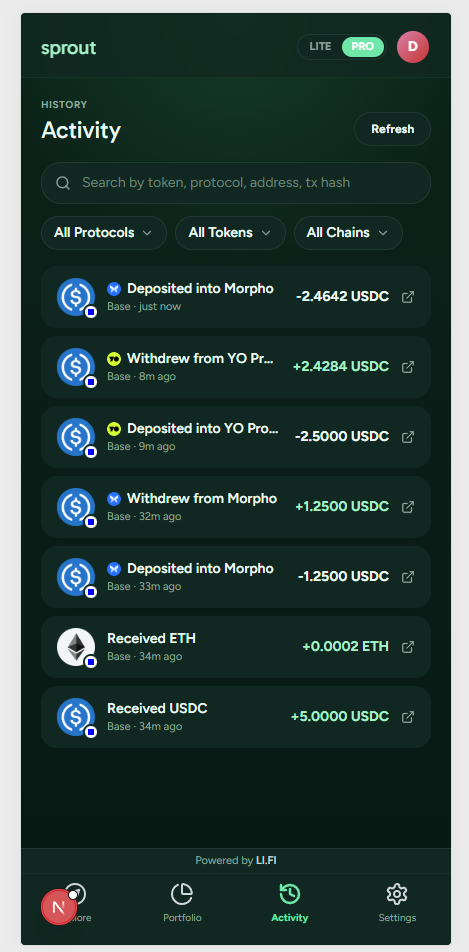
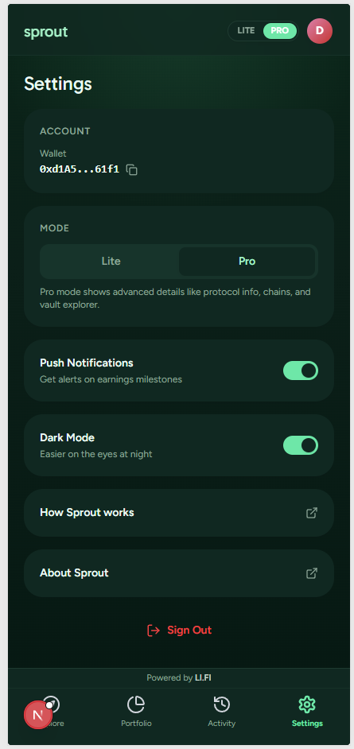

# Sprout

> Your money, growing every day.

Sprout is a Progressive Web App that makes earning DeFi yield as simple as opening a savings account. Built for the **LI.FI DeFi Mullet Hackathon** (DeFi UX Challenge track), Sprout is a "savings app that happens to be DeFi" — it hides the complexity of chains, bridges, vaults, and share tokens behind a warm, one-tap UX, and reveals the plumbing on demand through a Pro mode.

Users sign in with email / Google / X, answer 2–3 onboarding questions, and start earning with a single tap. Sprout auto-selects a sensible vault, handles bridges across chains, and shows positions as "money earning" instead of "ERC4626 shares".

---

## Screens

<p align="center">
  
  
  
</p>

<p align="center">
  
  
  
</p>

| Screen | File | What it shows |
|---|---|---|
| Landing | [`public/screenshots/landing.png`](public/screenshots/landing.png) | Pre-auth splash with the hero, feature chips, and the Start Earning CTA that launches Privy login. |
| Home — Lite | [`public/screenshots/home-lite.png`](public/screenshots/home-lite.png) | Simplified "savings app" view — balance summary + Earn More + recent activity. The default surface for new users. |
| Home — Pro | [`public/screenshots/home-pro.png`](public/screenshots/home-pro.png) | Full vault explorer with chain / protocol filters and search. Unlocked via the LITE/PRO toggle in the header. |
| Portfolio | [`public/screenshots/portfolio.png`](public/screenshots/portfolio.png) | Earning positions grouped by chain with per-position APY and Withdraw controls. Same surface in Lite and Pro. |
| Activity | [`public/screenshots/activity.png`](public/screenshots/activity.png) | Transfer history from `alchemy_getAssetTransfers`, grouped by tx hash and classified as deposit / withdrawal / transfer. |
| Settings | [`public/screenshots/settings.png`](public/screenshots/settings.png) | Wallet address, Lite/Pro toggle, dark mode, push notifications, sign out. |

---

## Table of contents

- [Screens](#screens)
- [What it does](#what-it-does)
- [Product modes](#product-modes)
- [Tech stack](#tech-stack)
- [Architecture](#architecture)
- [API surface](#api-surface)
- [Source tree](#source-tree)
- [Key flows](#key-flows)
  - [Deposit](#deposit)
  - [Withdraw](#withdraw)
  - [Positions (hybrid loader)](#positions-hybrid-loader)
  - [Smart withdraw planner](#smart-withdraw-planner)
- [LI.FI integration details](#lifi-integration-details)
  - [Integrator attribution + fee share](#integrator-attribution--fee-share)
  - [Rate limit and key handling](#rate-limit-and-key-handling)
- [State management](#state-management)
- [Security model](#security-model)
- [Running locally](#running-locally)
- [Project conventions](#project-conventions)

---

## What it does

Sprout turns six high-friction crypto steps into two taps:

| Traditional DeFi flow | Sprout Lite mode |
|---|---|
| 1. Pick a chain | Auto — Sprout picks the chain with your highest balance |
| 2. Pick a protocol | Auto — Sprout picks the highest APY safe vault |
| 3. Bridge if needed | Auto — LI.FI routes across chains |
| 4. Approve the share token | Auto — one-time approval handled in-flow |
| 5. Deposit | **Tap 1** — "Start Earning" |
| 6. Track P&L | **Tap 2** — Portfolio shows a single dollar number |

Under the hood, a single deposit can fan out into: swap source token → bridge to destination chain → approve underlying → ERC4626 deposit. Sprout orchestrates all four signatures and shows them as a live step list in the transaction modal.

---

## Product modes

Sprout has two faces driven by a single boolean in user preferences (`mode: "lite" | "pro"`):

### Lite mode (default for new users)
- Amount input + earn button. Nothing else.
- Destination vault auto-selected (highest APY + filter out leveraged / IL-risk / low-TVL).
- Source chain auto-selected across all supported chains, aggregated total shown.
- Multi-source deposits: Sprout allocates greedily from each chain with a balance (vault-chain first to save bridge cost, then descending balance).
- Smart-withdraw planner: user enters a USD amount, Sprout picks which positions to unwind first (lowest APY + chain-gas-aware scoring).
- No destination picker — withdrawals always exit to the position's own chain and underlying via zero-slippage ERC4626 redeem.

### Pro mode
- Full vault explorer with chain / protocol / asset / search filters.
- Manual chain + source token picker in deposit.
- Per-position partial withdraw modal with destination chain **and** output token dropdowns.
- Cross-chain exits: receive as USDC (or the same asset) on any supported chain — routed through LI.FI's swap + bridge aggregator.
- When the user customizes destination or token, Sprout skips the direct redeem probe and routes straight through LI.FI swap.

---

## Tech stack

Deliberately boring. No state-management library, no component kit, no wallet-SDK soup.

| Layer | Choice | Notes |
|---|---|---|
| Framework | **Next.js 16** (App Router, Turbopack) | API routes proxy every upstream call so keys stay server-side. |
| UI | **React 19** + **Tailwind CSS v4** | No shadcn / Radix / framer-motion — custom components, hand-rolled CSS keyframes. |
| Icons | Lucide | |
| Auth + wallet | **Privy** (`@privy-io/react-auth`) | Email / Google / X login, embedded wallets, EOA support. |
| Routing + execution | **LI.FI Advanced Routes** (`li.quest/v1/advanced/routes`) | Primary bridge + swap + deposit routing. |
| Vault catalog | **LI.FI Earn API** (`earn.li.fi/v1/earn/vaults`) | Paginated vault metadata. |
| Wallet RPC | **Alchemy** | Per-chain `alchemy_getTokenBalances` + batched `eth_call` for vault shares. |
| Prices | **CoinGecko** (`simple/price`) | Stablecoins hardcoded to $1. |
| Viem | Only used as a typed helper when needed | ABI encoding is mostly hand-rolled with `hex32` + 4-byte selectors. |

**Notably absent:** `@lifi/sdk`, `wagmi`, `ethers`, `zustand`, `redux`, `shadcn`, `radix-ui`, `framer-motion`. We briefly installed `@lifi/sdk` and ripped it out — direct HTTP proxies to the advanced routes endpoint proved more reliable under Privy's embedded wallet constraints.

---

## Architecture

```
┌────────────────────────────────────────────────────────────────┐
│                          Browser (PWA)                         │
│  ┌──────────┐  ┌──────────┐  ┌──────────┐  ┌────────────────┐  │
│  │ /home    │  │/portfolio│  │ /deposit │  │   /activity    │  │
│  │  Lite    │  │          │  │          │  │                │  │
│  │  +Pro    │  │          │  │          │  │                │  │
│  └────┬─────┘  └────┬─────┘  └────┬─────┘  └────────┬───────┘  │
│       │             │              │                │          │
│  ┌────┴─────────────┴──────────────┴────────────────┴───────┐  │
│  │    Shared-cache hooks (usePositions, useBalances,        │  │
│  │    useVaults, useActivity, usePrices, usePreferences)    │  │
│  │    — module-level Maps + pub-sub, no state library       │  │
│  └────┬─────────────┬──────────────┬────────────────┬───────┘  │
│       │             │              │                │          │
│       └─────────────┼──────────────┼────────────────┘          │
│                     ▼              ▼                            │
│             ┌──────────────────────────────┐                    │
│             │     Next.js API routes       │                    │
│             │  /api/routes  /api/quote     │                    │
│             │  /api/earn    /api/balances  │                    │
│             │  /api/tx-status /api/prices  │                    │
│             │  /api/vault-shares           │                    │
│             │  /api/step-transaction       │                    │
│             │  /api/activity               │                    │
│             └──────┬────────┬──────────┬───┘                    │
└────────────────────┼────────┼──────────┼─────────────────────┘
                     │        │          │
                     ▼        ▼          ▼
             ┌───────────┐ ┌────────┐ ┌────────────┐
             │  LI.FI    │ │Alchemy │ │ CoinGecko  │
             │  earn +   │ │ RPC    │ │ price API  │
             │  li.quest │ │        │ │            │
             └───────────┘ └────────┘ └────────────┘
```

**Three layers, clean boundaries:**

1. **Pages** render UI and call hooks. They don't talk to any upstream directly.
2. **Hooks** own shared state via module-level `Map`s + a tiny pub-sub. Every hook exposes a stable interface: `{ data, loading, error, reload }`. Internal load functions dedupe inflight promises, debounce bursty invalidations (600 ms for vault-stream driven refreshes), and coalesce concurrent requests so the UI is always consistent across pages.
3. **API routes** are thin proxies to LI.FI / Alchemy / CoinGecko. They inject API keys, stamp the `integrator=sprout_app` tag, cap slippage, and validate every client-provided parameter. The browser never sees a third-party endpoint directly.

---

## API surface

Every upstream call goes through a same-origin Next.js route under `/api/`. Grouped by purpose:

### LI.FI — routing, quotes, vaults, positions

| Sprout proxy | Upstream | Called by | Purpose |
|---|---|---|---|
| `POST /api/routes` | `li.quest/v1/advanced/routes` | deposit + withdraw executors | Primary route finder. Sets `integrator=sprout_app` + `fee: 0.0025` server-side. |
| `POST /api/step-transaction` | `li.quest/v1/advanced/stepTransaction` | deposit + withdraw step executors | Refresh calldata for subsequent steps in a multi-hop route. |
| `GET /api/tx-status` | `li.quest/v1/status` | deposit + withdraw flows | Poll cross-chain bridge status until `DONE`. |
| `GET /api/quote` | `li.quest/v1/quote` | deposit preview card only | Gas/price-impact estimate for the Pro deposit preview. Uses `toToken = underlying on destination` so the preview succeeds even for non-tradeable vault shares. |
| `GET /api/earn/v1/earn/vaults` | `earn.li.fi/v1/earn/vaults` | `useVaults` | Paginated vault catalog — primary source of vault metadata. Streamed in chunks of 100. |
| `GET /api/earn/v1/earn/chains` | `earn.li.fi/v1/earn/chains` | startup | Supported chain list. |
| `GET /api/earn/v1/earn/protocols` | `earn.li.fi/v1/earn/protocols` | vault filters | Protocol registry. |
| `GET /api/earn/v1/earn/portfolio/:addr/positions` | `earn.li.fi/v1/earn/portfolio/:addr/positions` | `usePositions` | Tier-1 position list. |

### Alchemy — balances, on-chain reads, activity

| Sprout proxy | RPC method | Called by | Purpose |
|---|---|---|---|
| `GET /api/balances?address=…` | `alchemy_getTokenBalances` + `eth_getBalance` | `useBalances` | Wallet balances for USDC/USDT/DAI/WBTC/ETH/POL across all 5 chains in one call per chain. |
| `POST /api/vault-shares` | `alchemy_getTokenBalances` + batched `eth_call convertToAssets(shares)` | positions augmenter + withdraw fallback | Detects wallet holdings of cached vault share tokens and returns the raw share balance + the underlying amount. Used to surface LST/LRT/wrapper holdings LI.FI's `/positions` endpoint misses. |
| `GET /api/activity?address=…` | `alchemy_getAssetTransfers` | `useActivity` | Transfer history for the Activity page. Groups by tx hash client-side. |

### CoinGecko

| Sprout proxy | Upstream | Notes |
|---|---|---|
| `GET /api/prices` | `simple/price` | USD prices for ETH / POL / WBTC. Stablecoins hardcoded to `$1`. Module-level cache with 60 s TTL. |

### Internal

- `GET li.quest/v1/keys/test` — called **once** on server cold-start by `lib/lifiIntegrator.ts`. Resolves the integrator name (`sprout_app`) associated with the LI.FI API key. Cached in the process for the life of the dyno so every subsequent `/api/routes` POST tags the correct integrator, earns the 25 bps fee, and counts against the right rate-limit bucket.

---

## Source tree

```
sprout/
├── public/                       # Static assets, manifest, service worker
│   ├── manifest.json
│   ├── sw.js
│   └── theme-init.js             # Applies dark class pre-hydration (no flash)
│
├── src/
│   ├── app/                      # Next.js 16 App Router
│   │   ├── layout.tsx            # Providers + service worker + install prompt
│   │   ├── page.tsx              # Root redirect → /home or /onboarding
│   │   ├── home/page.tsx         # Lite/Pro switching home page
│   │   ├── portfolio/page.tsx    # Earning positions + wallet balances
│   │   ├── deposit/page.tsx      # Lite + Pro deposit flow
│   │   ├── vault/[id]/page.tsx   # Vault detail with Earn More / Stop Earning
│   │   ├── activity/page.tsx     # Transfer history
│   │   ├── onboarding/page.tsx   # 3-question onboarding
│   │   ├── settings/page.tsx
│   │   └── api/                  # Next.js API route proxies
│   │       ├── routes/           # /v1/advanced/routes
│   │       ├── step-transaction/ # /v1/advanced/stepTransaction
│   │       ├── tx-status/        # /v1/status
│   │       ├── quote/            # /v1/quote (preview only)
│   │       ├── earn/[...path]/   # Generic earn.li.fi proxy
│   │       ├── balances/         # Alchemy getTokenBalances + eth_getBalance
│   │       ├── vault-shares/     # Alchemy vault-share holding + convertToAssets
│   │       ├── activity/         # Alchemy getAssetTransfers
│   │       └── prices/           # CoinGecko simple/price
│   │
│   ├── components/               # React components, grouped by feature
│   │   ├── layout/               # Header, BottomNav, AuthGuard
│   │   ├── home/                 # BalanceCard, EmptyState, TrustBadges, RecentActivity
│   │   ├── portfolio/            # PositionCard, WalletActionBar, Smart/Partial withdraw modals
│   │   ├── deposit/              # AmountInput, TokenSelector, DepositPreview, TransactionModal
│   │   ├── vault/                # VaultCard + dropdowns (chain, protocol, sort)
│   │   ├── activity/             # ActivityRow, TokenFilterDropdown
│   │   ├── ui/                   # Button, Card, Badge, TokenIcon, CardSkeletons, Toggle
│   │   ├── providers/            # PrivyProvider, ThemeSync, ServiceWorkerRegister, InstallPrompt
│   │   ├── settings/             # AboutModal, HowItWorksModal
│   │   └── onboarding/           # QuestionCard
│   │
│   ├── lib/
│   │   ├── api/                  # Thin typed clients for our own proxy routes
│   │   │   ├── earn.ts           # fetchVaults, fetchVaultsStreaming, fetchPositions
│   │   │   ├── composer.ts       # getDepositQuote / getWithdrawQuote (preview only)
│   │   │   ├── lifiRoutes.ts     # getRoutes, populateStep, getTransferStatus (advanced routes)
│   │   │   └── icons.ts          # DefiLlama protocol logo URL builder
│   │   │
│   │   ├── hooks/                # Shared-cache hooks (see "State management" below)
│   │   │   ├── useVaults.ts      # Streamed vault catalog
│   │   │   ├── usePositions.ts   # Hybrid: LI.FI /positions + on-chain augmentation
│   │   │   ├── useBalances.ts    # Wallet token balances across 5 chains
│   │   │   ├── useActivity.ts    # Transfer history
│   │   │   ├── usePrices.ts      # USD prices (module-level cache)
│   │   │   ├── usePreferences.ts # localStorage-backed user prefs
│   │   │   ├── useDepositFlow.ts # Multi-source, multi-step deposit orchestrator
│   │   │   ├── useWithdrawFlow.ts# Single-position withdraw orchestrator
│   │   │   └── useSmartWithdrawFlow.ts # Lite-mode aggregated withdraw planner
│   │   │
│   │   ├── withdrawExecutor.ts   # On-chain exit: ERC4626 redeem first, LI.FI fallback
│   │   ├── withdrawPlanner.ts    # Lowest-APY-first greedy planner for smart withdraw
│   │   ├── depositEncoder.ts     # ERC20 approve / allowance / balanceOf / ERC4626 deposit
│   │   ├── withdrawal.ts         # Protocol capability helpers
│   │   ├── activity.ts           # Classify activity groups (deposit/withdraw/transfer)
│   │   ├── schemas.ts            # Runtime guards for upstream API responses
│   │   ├── types.ts              # Shared TypeScript interfaces
│   │   ├── constants.ts          # Chain IDs, token addresses, network slugs, timeouts
│   │   ├── format.ts             # formatCurrency, formatPercent, etc.
│   │   ├── protocols.ts          # Protocol display-name / risk-tag helpers
│   │   ├── refresh.ts            # refreshEverything() — invalidate all caches at once
│   │   └── lifiIntegrator.ts     # Resolves sprout_app integrator name from API key
│   │
│   └── stores/
│       └── preferences.ts        # localStorage wrapper for useSyncExternalStore
│
├── next.config.ts                # Remote image domains (llamao, coingecko, cmc)
├── tailwind.config.ts            # Custom sprout theme (colors, fonts, shadows)
├── tsconfig.json
└── package.json
```

---

## Key flows

### Deposit

The deposit flow (`src/lib/hooks/useDepositFlow.ts`) takes a list of **sources** (one per source chain + token) and a target vault, then builds an ordered plan of on-chain steps:

```
PLAN = [
  directFund?  // no tx, just tally — for same-chain sources
  bridge*      // zero or more LI.FI hops (swap + bridge + swap)
  approve?     // skipped if allowance ≥ deposit amount
  deposit      // ERC4626 vault.deposit(assets, receiver) at the end
]
```

Execution loop, one step at a time:

1. **Bridge hop** — `populateStep(lifiStep)` refreshes calldata. Wallet switches chain, `eth_sendTransaction`, poll `eth_getTransactionReceipt`, then poll `/v1/status` for `DONE`. Terminal bridge steps add `toAmountMin` to the running `depositAmountRaw`.
2. **Wait for landing** — right before the approve step, poll the destination token's `balanceOf(wallet)` until it reflects the bridged amount. Catches the LI.FI-status-ahead-of-wallet-RPC race that used to cause `TRANSFER_FROM_FAILED` reverts.
3. **Approve** — `eth_call allowance(wallet, vault)`; if insufficient, `approve(vault, MAX_UINT256)`.
4. **Deposit** — `vault.deposit(amount, wallet)` via ERC4626 directly on the vault contract. No router, no composer.

Every step lands in `TransactionModal`'s step list in real time with pending → active → done states and explorer links. The modal never flips to success until the final deposit's receipt is mined — no early "your money is growing" claims while a bridge is still in flight.

### Withdraw

Three-tier priority in `src/lib/withdrawExecutor.ts`:

1. **Direct ERC4626 redeem** (preferred when possible)
   - Pre-flight probe: `eth_call asset()` on the vault. If it returns the expected underlying, the vault implements ERC4626.
   - Full withdrawal → `redeem(shares, wallet, wallet)` using the cached `position.shareBalanceRaw` (populated by the on-chain augmenter) for zero-round-trip execution.
   - Partial withdrawal → `withdraw(assets, wallet, wallet)` with the underlying amount.
   - Zero slippage, one tx.

2. **LI.FI swap / bridge** (fallback, or first choice on custom exits)
   - Triggers when: the vault isn't ERC4626 (EtherFi weETH, Lido stETH, Curve LP wrappers), user picked a cross-chain destination, user picked a different output token, or direct redeem reverted at the wallet.
   - `getRoutes({ fromToken: vault.address, fromAmount: shareBalance, toChain, toToken })` → signs every `route.steps[i]` in order including the ERC20 approval to LI.FI's diamond.
   - `preferLifiSwap: true` flag lets the Pro withdraw modal skip the ERC4626 probe entirely when the user explicitly picks a custom destination.

3. **Clear-error stop** — if neither path works (no LI.FI route **and** no direct path), throw with a user-friendly message instead of a cryptic revert.

User cancellations are detected via `isUserRejection()` (checks EIP-1193 code 4001, `ACTION_REJECTED`, and message substrings across Privy / MetaMask / Rabby / Coinbase Wallet) and rethrown as `UserRejectedError` — the flow never silently falls through to another method after the user says no.

### Positions (hybrid loader)

`src/lib/hooks/usePositions.ts` uses a two-tier source:

**Tier 1 — LI.FI `/v1/earn/portfolio/{addr}/positions`**
- One call, returns canonical vault positions (Morpho, Yo, Aave, Moonwell, Polymarket, etc.).
- Filtered by supported chains + dust threshold.
- Decorated with `vaultAddress` from the shared vault cache via case-insensitive protocol match.

**Tier 2 — On-chain augmentation**
- For each supported chain, one `POST /api/vault-shares` call: sends every cached vault share address for that chain, Alchemy returns the ones the wallet actually holds + their raw share balance + `convertToAssets(shares)`.
- For each held entry, if it matches an existing LI.FI position → attach `shareBalanceRaw` so the withdraw flow can redeem without an RPC probe.
- For each held entry not in the LI.FI list → synthesize a `Position` with `protocolName` from the vault, `asset` from its underlying, `balanceUsd` priced via the cached `livePrices`, and `shareBalanceRaw` for withdraw.

This is what surfaces **EtherFi weETH, Lido wstETH, sDAI, sUSDe, ezETH, rsETH**, and anything else that's a tokenized yield position held directly in the wallet rather than tracked as a distinct stake by LI.FI's indexer.

Sorted by USD value desc, written to the shared cache, subscribers notified.

### Smart withdraw planner

`src/lib/withdrawPlanner.ts` takes a user-entered USD amount and builds an ordered list of `WithdrawStep`s across every position. Each position is scored on:

- **APY** — lower first (unwind the worst earners first).
- **Chain gas penalty** — Ethereum gets a `50` penalty, L2s get `1`, Polygon `2`. So mainnet positions are preserved unless the user explicitly wants them gone.
- **Balance** — if two positions tie on APY + chain, the larger one goes first.

Greedy allocation: walk the sorted list, pull from each until the requested USD is covered. Used by Lite mode's `SmartWithdrawModal` — user types "$50", sees a live preview of which positions will be touched, one button signs them back-to-back.

---

## LI.FI integration details

### Integrator attribution + fee share

Sprout earns **25 bps** on every deposit + withdraw routed through LI.FI, split on-chain by the new `FeeForwarder` contract.

Critical gotcha we hit and fixed: the integrator name is case- and spelling-sensitive. Hardcoding `"sprout"` silently dropped the fee because the LI.FI partner portal had registered the key as `sprout_app`. The fix lives in `src/lib/lifiIntegrator.ts`:

```ts
// lib/lifiIntegrator.ts (server-side)
export async function getLifiIntegrator(): Promise<string | null> {
  // Calls GET li.quest/v1/keys/test once on cold start,
  // reads user.name from the response, caches for the life
  // of the process. Both /api/routes and /api/quote inject
  // the resolved name + fee: 0.0025 into their payloads.
}
```

If the key ever rotates and maps to a different integrator name, Sprout picks it up on the next cold start — no code change.

### Rate limit and key handling

- **One `LIFI_API_KEY`** env var. Every LI.FI request carries it as `x-lifi-api-key`. Server-side only; the browser never sees it.
- All requests bill against the same `sprout_app` rate-limit bucket (100 req/s), so vaults catalog, positions, routes, status polls, and step refreshes all share capacity.
- **One `ALCHEMY_API_KEY`** env var. Per-chain Alchemy URLs are built from `ALCHEMY_NETWORK_BY_CHAIN` in constants.
- CoinGecko's free endpoint is called without a key (just `/api/prices`).

---

## State management

No Redux, no Zustand, no Jotai, no Recoil. The entire shared state layer is a pattern we call "module-level cache + pub-sub", reimplemented for each hook in ~100 lines:

```ts
// Shape shared by useVaults, usePositions, useBalances, useActivity
const cache = new Map<string, TData>();
const inflight = new Map<string, Promise<TData>>();
const subscribers = new Map<string, Set<(data: TData) => void>>();

function notify(key: string) { /* fire all subscribers */ }
function subscribe(key: string, cb) { /* add/remove */ }

async function load(key: string): Promise<TData> {
  if (inflight.has(key)) return inflight.get(key)!; // dedupe
  const promise = fetchUpstream(key)
    .then(data => { cache.set(key, data); notify(key); return data; })
    .finally(() => inflight.delete(key));
  inflight.set(key, promise);
  return promise;
}

export function useData(key: string) {
  const [data, setData] = useState(cache.get(key) ?? EMPTY);
  useEffect(() => {
    if (cache.has(key)) setData(cache.get(key)!);
    load(key);
    return subscribe(key, setData);
  }, [key]);
  return { data /*, loading, error, reload */ };
}
```

Benefits:

- **Cross-component consistency:** when `usePositions` updates in the deposit flow, every mounted consumer (home page, portfolio page, vault detail) re-renders with fresh data — no prop drilling.
- **Automatic request dedupe:** two components mounting simultaneously share one upstream call via the `inflight` map.
- **Coalesce flag for vault-stream driven refreshes:** if a refresh arrives while one is in flight, a `staleFlags` set marks the inflight as stale. The current run fires exactly one follow-up after it settles instead of kicking a parallel build. Prevents API call bursts.
- **Debounced listeners:** `usePositions.onCachedVaultsChanged` debounces by 600 ms so 10 paginated vault pages land as **one** re-decorate instead of 10 rebuilds.
- **Zero bundle cost:** adds nothing. State lives in module scope, React hooks just subscribe to it.

`usePreferences` is the one exception — it's backed by `localStorage` via `useSyncExternalStore` in `src/stores/preferences.ts` so user mode (Lite/Pro), dark mode, and risk acknowledgment persist across page loads.

---

## Security model

- **Never trust the client.** Every proxy route validates its inputs (address regex, positive integers, slippage caps, length limits) and rebuilds the outbound payload from scratch. Clients can't bypass slippage caps or inject extra query parameters.
- **Keys server-side only.** `LIFI_API_KEY`, `ALCHEMY_API_KEY` are read from `process.env` in API route handlers. Never exposed in client bundles.
- **Integrator + fee injected server-side.** The client can't spoof `integrator` or `fee` parameters — they're overwritten by the proxy.
- **Slippage cap.** `MAX_SLIPPAGE = 3%` hard limit, enforced before forwarding to LI.FI. `DEFAULT_SLIPPAGE = 0.5%` if the client omits it.
- **Path allowlists.** `/api/earn/[...path]` only forwards paths matching `EARN_API_PATH_ALLOWLIST` regexes. Arbitrary LI.FI paths are blocked with a 404.
- **Query allowlists.** `EARN_API_QUERY_ALLOWLIST` + `QUOTE_API_QUERY_ALLOWLIST` sets filter inbound query params so clients can't smuggle upstream parameters they shouldn't control.
- **Address regex.** Any client-supplied wallet / token / vault address is validated against `/^0x[0-9a-fA-F]{40}$/` before it leaves the proxy.
- **No-store headers.** Every proxy response sets `Cache-Control: no-store, must-revalidate` so browsers and CDNs can't cache stale data across users.

---

## Running locally

```bash
# Clone + install
git clone <repo>
cd sprout
npm install

# Configure env
cp .env.example .env.local
# Fill in:
#   LIFI_API_KEY=<your li.fi partner portal key>
#   ALCHEMY_API_KEY=<your alchemy key>
#   NEXT_PUBLIC_PRIVY_APP_ID=<your privy app id>

# Dev
npm run dev
# → http://localhost:3000

# Production build
npm run build
npm run start
```

Requirements:
- **Node 20+**
- A LI.FI API key registered via the [Partner Portal](https://portal.li.fi) — it auto-generates the integrator name on `sprout_app` when you claim it. If you use a different integrator name, change it in the portal; Sprout reads it dynamically.
- An Alchemy account with all 5 supported chains enabled (Ethereum, Base, Arbitrum, Optimism, Polygon).
- A Privy app configured for email / Google / X social login + embedded wallets.

---

## Project conventions

- **Many small files.** Most files are 100–300 lines. Anything pushing 500 gets split.
- **Hooks own state, pages own layout.** Pages don't touch `fetch`, hooks don't touch JSX.
- **Minimal comments, load-bearing only.** Comments explain *why*, never *what*. "This fires before switchChain resolves under Privy" is useful; "// fetch positions" isn't.
- **Typed API boundaries with loose runtime guards.** `schemas.ts` validates the minimum fields we actually consume from upstream responses. Everything else passes through untyped.
- **Handle rejects, surface errors.** Every flow has a catch that translates provider errors into user-readable messages. `isUserRejection()` is applied everywhere a wallet prompt happens.

---

— `sprout@0.1.0` · built for the LI.FI DeFi Mullet Hackathon · 2026
